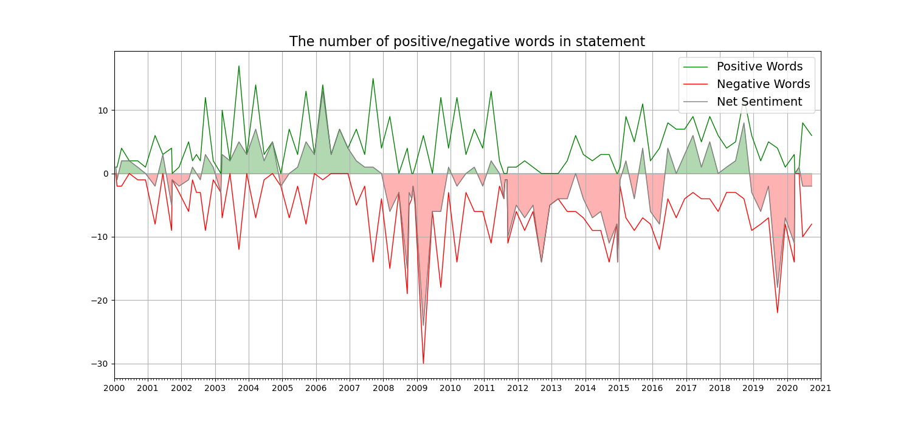
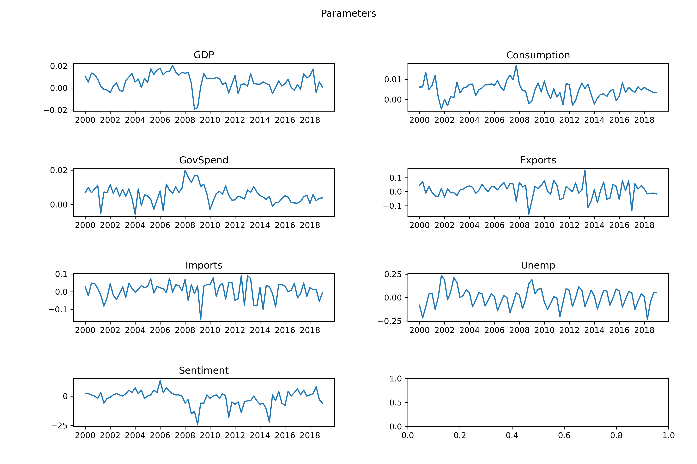

# Sentiment Analysis of Central Bank statement

## Repository structure

short introduction

### 01_SNB_PDF_Webscaper
This script scrapes the [monetary policy assessment](https://www.snb.ch/en/iabout/monpol/id/monpol_current) pdf files of the Swiss National Bank from the period 2000 to 2020 and saves them in the data folder.

### 02_PDF_Reader
This script reads the pdf files from the folder data/lagebeurteilungenSNB with the package pytesseract. The output is an excel file called articles_raw.xlsx and saved in data folder.

### 03_Cleaning_EDA
This scipt cleans the unstrucuted text data and performs an LDA analysis. The output is LDA_visualization.html and several plots saved in the plots folder.

10 most common words used in the monetary policy assessment

Wordcloud

 - https://github.com/sddiener/SDA_2020/blob/master/LDA_visualization.html

### 04_Sentiment
Count of positve vs. negative words with fed dictionary

### 05_Quant_Data

Economic predictor variables for the GDP forecasting model

Model results
