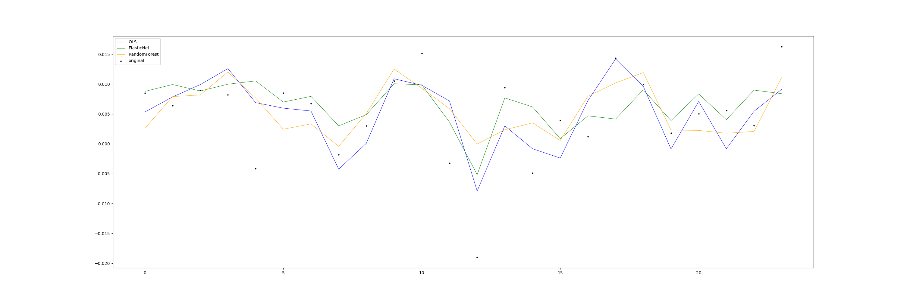

# Sentiment Analysis of Central Bank statement

A central bank's communication is nowadays a core element of monetary policy, and in that sense it is actually a monetary policy tool itself. The analysis of central bank communication can provide important insights into the economic outlook as well as signals about the future course of policy.
In this repository, the swiss national Bank's monetary policy assessments are analyzed to predict developments in the economy.

## Repository structure

### 01_SNB_PDF_Webscaper
This script scrapes the [monetary policy assessment](https://www.snb.ch/en/iabout/monpol/id/monpol_current) pdf files of the Swiss National Bank from the period 2000 to 2020 and saves them in the data folder.

### 02_PDF_Reader
This script reads the pdf files from the folder data/lagebeurteilungenSNB with the package pytesseract. The output is an excel file called articles_raw.xlsx and saved in data folder.

### 03_Cleaning_EDA
This scipt cleans the unstrucuted text data and performs an LDA analysis. 
The input is the articles_raw.xlsx taken from the data folder.
The output generates the following:
- articles_clean.xlsx in data folder
- Several plots saved in the plots folder (e.g 10 most common words, wordcloud)
- LDA_visualization.html

#### 10 most common words used in the monetary policy assessment

#### Wordcloud

#### LDA Visualization

### 04_Sentiment
This script generates a sentiment indicator which counts the number of positive and negative words used in the monetary policy assessments. The fed dictionary was the main dictionary used in the analysis.
The two inputs are taken from the data folder:
- Dictionary.py (includes the [Fed dictionary](https://www.federalreserve.gov/econres/notes/ifdp-notes/constructing-a-dictionary-for-financial-stability-20170623.htm) and the [Lougrahn Mcdonald sentiment word list](https://sraf.nd.edu/textual-analysis/resources/))
- articles_clean.xlsx  

The output is the following: 
- NetSentiment.csv timeseries indicator saved in data folder
- Plot of net positve vs. negative words

#### Count of positve vs. negative words with fed dictionary

### 05_Quant_Data
This script uses economic data from [FRED and trains different models to predict the GDP growth of Switzerland. The Input is the NetSentiment.csv indicator used as explanatory variables.

#### Economic predictor variables for the GDP forecasting model

#### Model results
